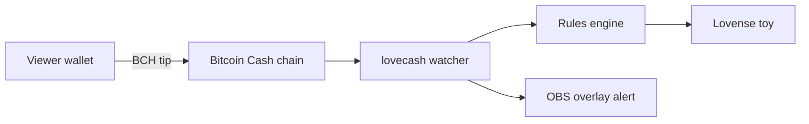

# lovecash

Turn Bitcoin Cash tips into Lovense toy actions. Performer-first,
open source, and non-custodial — tips go straight to your wallet, and
this software never touches your keys or your money.

## What it does

When a viewer sends you a BCH tip, lovecash detects it on-chain and
triggers your Lovense toy according to rules you set. It ships with a
ready-made OBS overlay (a tip QR code plus live tip alerts) so the only
setup on your end is dropping one URL into OBS.



## Why it's built this way

- Non-custodial. Your config holds only your public receiving address.
  There are no private keys anywhere in this software. It cannot move
  your funds because it never has them.
- Performer-first. You author the rules. Hard limits on intensity and
  duration are enforced in code, and a panic stop blocks every command
  until you resume it — no incoming tip can override it.
- No chargebacks. BCH payments are final, with sub-cent fees that make
  small tips viable.
- Open source (AGPL-3.0). Self-host the whole thing, or use a hosted
  relay as a convenience layer.

## Requirements

- [uv](https://docs.astral.sh/uv/).
- The Lovense Connect app (phone or desktop). This is the local-API app, not the Lovense Remote app.
- A Bitcoin Cash wallet you control (e.g. Electron Cash).
- For the OBS overlay: OBS with a Browser source.

## Install

```bash
uv sync # core only
uv sync --extra server # adds the OBS overlay relay
uv sync --extra server --group dev   # everything, incl. tests
```

## Quick start

Three commands and you're live:

```bash
uv run lovecash init      # answer a few questions, writes config.yaml
uv run lovecash doctor    # checks your xPub, node, and toy connection
uv run lovecash serve     # starts the bridge + OBS overlay
```
`init` only ever asks for your wallet xPub. If you mistype
anything, `doctor` tells you in plain English what to fix.

## Add the overlay to OBS

This is the entire setup a performer needs:

1. Run `uv run lovecash serve`. It prints your overlay URL.
2. In OBS: Sources -> add -> Browser.
3. URL: `http://localhost:8080/overlay`
4. Size: 1920 x 1080. Done.

The overlay shows a persistent tip QR (bottom-right) and pops an animated
alert on every incoming tip. Viewers scan the QR with any BCH wallet.

## Configuring your tip rules

Rules live in `config.yaml`. Each rule maps a tip range (in satoshis) to
a toy action. Rules are matched highest-tier-first, so a big tip wins
over a small-tier default.

```yaml
limits:
  max_strength: 12 # hard cap on the 0-20 Lovense scale
  max_duration_s: 30 # hard cap on seconds per command
  min_seconds_between_commands: 0.5

rules:
  - name: "tease"
    min_sats: 1000
    max_sats: 9999
    action: "Vibrate"
    strength: 4
    duration_s: 3
  - name: "intense"
    min_sats: 50000
    action: "Vibrate"
    strength: 12
    duration_s: 20
```
`limits` always wins: even if a rule asks for strength 20, it is clamped
to your`max_strength`. Note that each rule is a list item and must start
with`-`.

## Safety

- Panic stop. Press Ctrl-C while running locally, or POST to`/panic`
  on the relay. It halts the toy and blocks all further commands until
  you explicitly resume. No payment can clear it.
- Hard limits.`max_strength` and`max_duration_s` are enforced in the
  controller, below the rules layer.
- Rate limiting.`min_seconds_between_commands` prevents tip-spam from
  overdriving your toy.
- The relay refuses to start on a public address without a relay token,
  so`/resume` can never be left exposed to the internet.

First-time testing tip: set`max_strength: 3`, leave the toy off your
body, and confirm Ctrl-C stops it mid-buzz before you trust it.

## CLI reference

| Command | What it does |
|---|---|
| lovecash init | Interactive setup wizard |
| lovecash doctor | Preflight checks: xPub, node, toy |
| lovecash run | Local bridge (watcher + toy), no overlay |
| lovecash serve | Bridge plus OBS overlay relay |
| lovecash qr | Save a tipping QR to a file |
| lovecash scripthash | Print an address's Electrum scripthash (debug) |

Common flags:`-c/--config` to point at a config file,`-v/--verbose`
for debug logging,`--skip-check` on `run` to skip the doctor preflight.

## HTTP endpoints (relay)

| URL | Purpose | Auth |
|---|---|---|
| /overlay | OBS browser source | none |
| /overlay-ws | Live tip websocket | none |
| /qr.png?amount=0.001 | Tip QR for a fixed amount | none |
| /qr.svg | Vector tip QR | none |
| /uri?amount=0.001 | Raw BIP21 URI as JSON | none |
| /panic | Stop and block all commands | token |
| /resume | Clear the panic stop | token |
| /health | Liveness and stop state | none |

Read-only endpoints are unauthenticated by design — they only expose a
public receiving address. Control endpoints require the relay token.

## How it works

1. The watcher subscribes to your addresses on an Electrum/Fulcrum server
   and emits a tip event for each new inbound payment.
2. The rules engine maps the tip amount to a toy command.
3. The controller clamps it to your limits and sends it to the local
   Lovense Connect API — gated by the safety layer.

Small tips can act on 0-conf; tips above `zeroconf_max_sats` wait for a
confirmation, which you tune in config.

## Self-hosting the relay

```bash
uv run lovecash serve -c config.yaml
```

To expose it publicly, set a long random `server.relay_token` and put it
behind TLS. The app refuses to bind to a non-loopback address without a
token. A container build is included:

```bash
docker compose up --build
```

## Development

```bash
uv sync --extra server --group dev
uv run python -m compileall lovecash tests   # catch syntax issues fast
uv run ruff check .
uv run --extra server pytest -v
```

Live-network tests (against a real Electrum server) are opt-in:

```bash
uv run pytest -m integration
```


## License

lovecash is licensed under the **GNU Affero General Public License
v3.0-or-later (AGPL-3.0-or-later)**. See [LICENSE](LICENSE).

In plain terms:

- **Use it, fork it, modify it, self-host it — freely.** It's genuinely
  open source.
- **If you run a modified version as a network service**, the AGPL
  requires you to make your modified source available to that service's
  users under the AGPL.
- **Your funds stay yours.** This is unrelated to licensing, but worth
  repeating: lovecash is non-custodial and never holds your keys.

### Commercial licensing

Need to use lovecash in a way the AGPL doesn't allow — for example, a
closed-source hosted service? A separate commercial license is
available. See [COMMERCIAL.md](COMMERCIAL.md).

### Contributing

Contributions are welcome. Because lovecash is dual-licensed (AGPL plus
commercial), contributors are asked to agree to a
[Contributor License Agreement](CLA.md) so contributions can be included
in both tracks. The CLA bot will prompt you on your first pull request.
